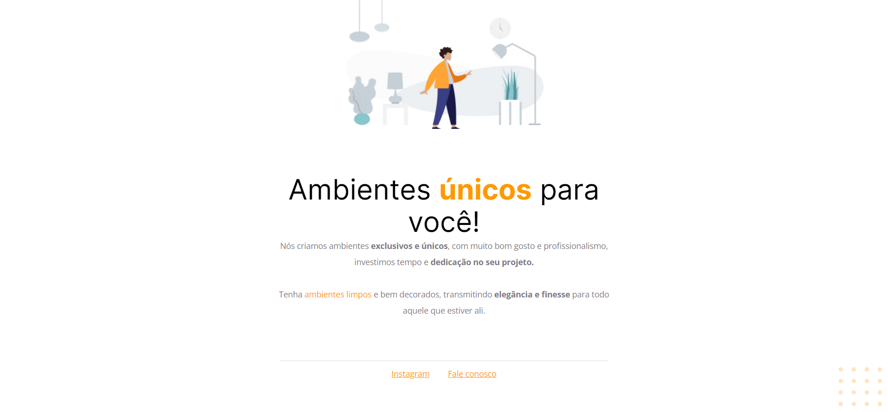

<h1 align="center">
  
</h1>

<h1 align="center">Corrigindo Bugs</h1>

Sobre o desafio: Nesse desafio, você receberá um código com o projeto desenvolvido durante as aulas da Fase 01.
Mas, a surpresa vem aí...  👀  
O código sofreu algumas alterações e, como podemos ver na imagem abaixo, ele não está mais da mesma forma que o Maykão deixou.

  
<h2 >🚀 Tecnologias Utilizadas</h2>
<ul>
<li>HTML</li>
<li>CSS</li>
</ul>
 
<h2>🚧 Projeto</h2>

Live preview: <a href="https://renancaldasdev.github.io/renancaldasdev-explorer-stage02-corrigindo-bugs01/">Corrigindo Bugs 01</a>
  

<h3>Projeto Corrigido</h3>

---

Feito com toda a dedicação 👨‍💻 por Renan Caldas

